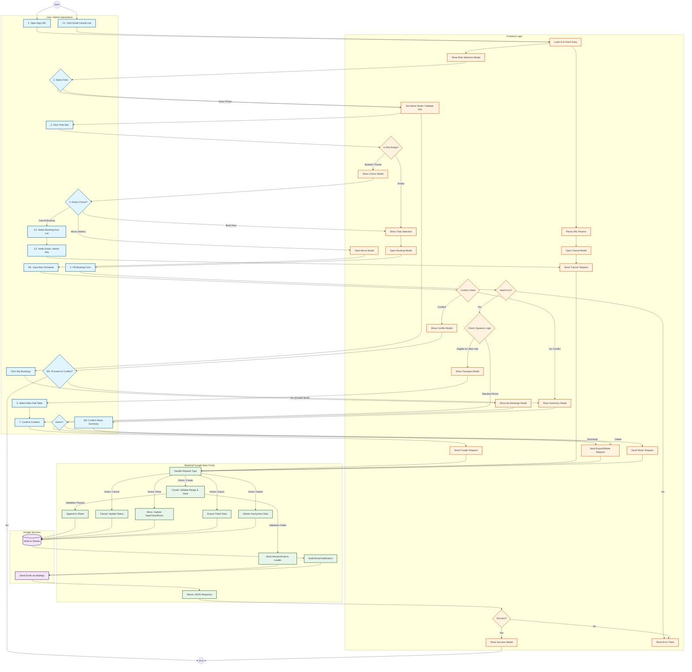

# CCF Manila Room Reservation System — Process Flow Diagram

> **Version:** 2.0  
> Complete Mermaid flowchart of all User and Admin journeys including **Booking**, **Cancellation**, **Email Deep-Link Cancellation**, **Move/Reschedule**, **GDPR**, and **Block Dates** workflows.

---

## Swimlane Legend

| Color | Layer | Description |
|-------|-------|-------------|
| 🔵 Light Blue | User / Admin Interactions | Human actions (clicks, form fills, decisions) |
| 🟠 Orange | Frontend Logic | Client-side validation, UI rendering, API calls |
| 🟢 Green | Backend (Apps Script) | Server-side validation, business logic, data operations |
| 🟣 Purple | Google Services | Google Sheets I/O, MailApp email sending |

---

## Flow Diagram

