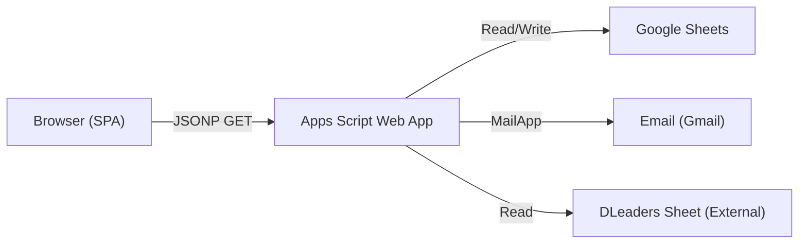
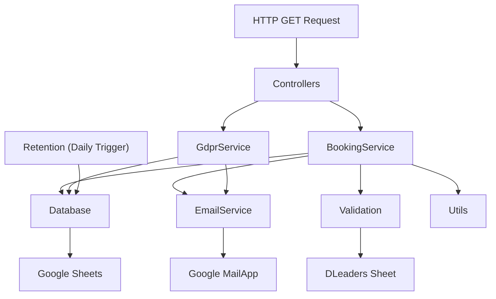

# CCF Manila Room Reservation System — Developer Guide

> **Version:** 2.0  
> Technical reference for developers maintaining or extending the system.  
> For deployment instructions, see the [Deployment Guide](DEPLOYMENT_GUIDE.md).  
> For API endpoints, see the [API Reference](API_REFERENCE.md).

---

## Table of Contents
- [Architecture Overview](#architecture-overview)
- [Data Flow](#data-flow)
- [Project Structure](#project-structure)
- [Frontend Architecture](#frontend-architecture)
- [Backend Architecture](#backend-architecture)
- [Key Features & Implementation](#key-features--implementation)
- [Testing](#testing)

---

## Architecture Overview

This is a **Serverless Single-Page Application (SPA)**.

| Layer | Technology | Hosting |
|-------|-----------|---------|
| **Frontend** | HTML5, Vanilla JS (ES6 modules), Tailwind CSS (CDN) | GitHub Pages |
| **Backend / API** | Google Apps Script (GAS), deployed as Web App | Google Cloud |
| **Database** | Google Sheets (4 sheets: Bookings, BlockedDates, Settings, Logs) | Google Drive |
| **Libraries** | Luxon.js (dates), D3.js (dashboard charts), Lucide (icons), Google Fonts | CDN |

---

## Data Flow



- **Read:** Frontend sends JSONP request (`action=fetch_all`) to Apps Script, which reads from Google Sheets and returns JSON.
- **Write:** Frontend sends JSONP request with payload (e.g., `action=create`) to Apps Script, which validates, writes to Sheets, sends email, and returns response.
- **JSONP:** Used instead of `fetch()` to bypass CORS restrictions. The response is wrapped in a callback function injected via `<script>` tag.

---

## Project Structure

```
BookingSystem/
├── index.html                    # Main booking calendar SPA
├── dashboard.html                # Admin dashboard (charts, tables, settings)
├── privacy.html                  # Privacy policy page
├── config.js                     # Frontend configuration (URLs, rooms, hours)
├── script.js                     # Entry point (imports ES6 modules)
├── style.css                     # Custom CSS (branding, D3 tooltips, overrides)
│
├── js/                           # Frontend ES6 modules
│   ├── api.js                    #   API communication (JSONP wrapper)
│   ├── calendar.js               #   Calendar rendering and slot management
│   ├── formHandlers.js           #   Booking form submission and validation
│   ├── modals.js                 #   Modal open/close logic and event wiring
│   ├── state.js                  #   Global app state management
│   ├── admin.js                  #   Admin-specific UI logic
│   └── utils/                    #   Utility modules
│       ├── componentLoader.js    #     Dynamic HTML component loader
│       ├── date.js               #       Date/time helpers (Luxon wrappers)
│       ├── dom.js                #       DOM manipulation utilities
│       └── validation.js         #       Client-side form validation
│
├── components/                   # HTML components (loaded dynamically)
│   ├── modals/                   #   Modal HTML templates
│   │   ├── booking-modal.html    #     Main booking form modal
│   │   ├── cancel-modal.html     #     Cancellation modal
│   │   ├── email-cancel-modal.html #   Email deep-link cancel modal
│   │   ├── move-modal.html       #     Move/reschedule modal
│   │   ├── my-bookings-modal.html #    My Bookings portal modal
│   │   ├── floorplan-modal.html  #     Main Hall table selection
│   │   ├── success-modal.html    #     Booking success confirmation
│   │   ├── denied-modal.html     #     Denied booking notification
│   │   ├── info-modals.html      #     Terms, privacy, confirm summary
│   │   └── admin-login-modal.html #    Legacy admin modal (deprecated)
│   └── shared/                   #   Shared layout components
│       ├── header.html           #     App header with navigation
│       ├── announcement.html     #     Announcement banner template
│       └── loader.html           #     Loading spinner overlay
│
├── appscript/                    # Backend (Google Apps Script) source
│   ├── Config.js                 #   Constants, room config, admin PIN
│   ├── Controllers.js            #   HTTP request router (doGet)
│   ├── BookingService.js         #   Create, cancel, move, block, fetch logic
│   ├── Database.js               #   Google Sheets read/write operations
│   ├── EmailService.js           #   Email template builder and sender
│   ├── GdprService.js            #   GDPR export and deletion
│   ├── Retention.js              #   Auto-anonymization of expired data
│   ├── Utils.js                  #   UUID, validation, logging, date helpers
│   └── Validation.js             #   DLeaders name fuzzy matching
│
├── tests/                        # End-to-end tests (Playwright + pytest)
│   ├── conftest.py               #   Shared fixtures
│   ├── test_user_journey.py      #   User booking flow tests
│   ├── test_admin_journey.py     #   Admin feature tests
│   ├── test_e2e_reservation.py   #   Full reservation lifecycle tests
│   ├── requirements.txt          #   Python dependencies
│   └── run_tests.bat             #   Windows test runner script
│
├── project-docs/                 # Consolidated documentation
│   ├── index.md                  #   Documentation hub
│   └── ...                       #   See project-docs/index.md
│
├── img/                          # Static assets (QR codes, logo)
└── _bmad/                        # BMad Builder framework config
```

---

## Frontend Architecture

### Component Loader

HTML modals and shared components are stored as separate `.html` files and loaded dynamically at startup:

```javascript
// js/utils/componentLoader.js
// Injects HTML from components/ into injection points in index.html
// e.g., <div id="component-booking-modal"></div> ← booking-modal.html
```

**Injection points** in `index.html` follow the pattern:
```html
<div id="component-{name}"></div>
```

### State Management

The app uses a centralized state object in `js/state.js`:

```javascript
export const state = {
  isAdmin: false,           // Admin mode active
  currentRoom: 'Main Hall', // Selected room
  currentWeek: Date,        // Current week being viewed
  allBookings: [],          // Cached booking data
  blockedDates: [],         // Cached blocked dates
  announcement: {},         // Banner settings
  reservationWindow: {},    // Window settings
  // ...
};
```

### Module Responsibilities

| Module | Purpose |
|--------|---------|
| `api.js` | JSONP request wrapper, callback management, retry logic |
| `calendar.js` | Weekly grid rendering, slot click handling, capacity calculation |
| `formHandlers.js` | Form submission, squeeze logic, booking confirmation flow |
| `modals.js` | Modal show/hide, event binding, form population |
| `state.js` | Centralized state, data caching |
| `admin.js` | Admin-specific UI (dashboard link, admin form fields) |

### Modal Architecture

All modals use the native `<dialog>` element for:
- Proper z-index management (top-layer)
- Backdrop overlay via `::backdrop` pseudo-element
- Keyboard accessibility (Escape to close)

---

## Backend Architecture

### Module Map



| Module | Responsibility |
|--------|---------------|
| `Config.js` | Constants (Spreadsheet ID, PIN, room config, timezone) |
| `Controllers.js` | `doGet()` entry point — routes `action` parameter to handlers |
| `BookingService.js` | Core business logic: create, cancel, move, block, fetch |
| `Database.js` | All Google Sheets read/write operations |
| `EmailService.js` | HTML email templates and sending via `MailApp` |
| `GdprService.js` | Data export (`handleExportUserData`) and erasure (`handleDeleteUserData`) |
| `Retention.js` | Auto-anonymization of bookings older than `RETENTION_DAYS` |
| `Utils.js` | UUID generation, input validation, audit logging, date helpers |
| `Validation.js` | DLeaders name matching with Levenshtein fuzzy search |

> **Global Scope:** All `.gs` files in Google Apps Script share the same global scope. No `import`/`export` needed.

---

## Key Features & Implementation

### A. Race Condition Guard (Optimistic Locking)

**Location:** `BookingService.js` → `handleCreateBooking`

**Mechanism:** Uses a two-phase approach:
1. **Script Lock:** `LockService.getScriptLock()` with 30-second timeout ensures only one booking operation runs at a time.
2. **Double-Read:** After initial validation, the system re-reads all active bookings from the sheet to catch any bookings that were created between the first read and now.

### B. Squeeze Logic (Main Hall Auto-Upgrade)

**Location:** `js/formHandlers.js` → `checkMainHallAvailability`

**Mechanism:** When a user requests a Mezzanine room (Jonah/Joseph/Moses):
1. Frontend checks if Main Hall has capacity during the same time slot.
2. If eligible, opens the Interactive Table Selection Floorplan modal.
3. User picks an available table (T1–T6).
4. Booking is created for Main Hall instead, with `original_room` preserved.

### C. DLeaders Name Validation

**Location:** `Validation.js` → `validateNamesAgainstList`

**Mechanism:**
1. Fetches the DLeaders list from an external Google Sheet (cached 5 minutes).
2. Automatically selects the latest monthly tab.
3. Compares user input against all entries using **Levenshtein distance** with a **95% similarity threshold**.
4. Supports nickname matching (e.g., "Mike" → "Michael").
5. Failed validation silently sends a denial email to the user's leader.

### D. Email Deep-Link Cancellations

**Location:** `EmailService.js` → `sendConfirmationEmail` → `index.html` URL params → `js/modals.js`

**Mechanism:**
1. Backend embeds a URL with `?cancel_id={bookingId}&cancel_code={first8chars}` into the confirmation email.
2. Frontend detects these URL parameters on page load.
3. Bypasses the My Bookings flow and directly opens the cancellation modal.
4. User clicks "Yes, Cancel" to confirm.

### E. Reservation Window

**Location:** `Database.js` → `isReservationWindowCurrentlyOpen` + `BookingService.js`

**Mechanism:**
- Settings stored in the Settings sheet as key-value pairs.
- Converted to "weekly minutes" (e.g., Sunday 08:00 = 0×1440 + 480 = 480).
- Supports week-wrapping windows (e.g., Saturday → Monday).
- Non-admin booking attempts outside the window throw an error.

### F. Blocked Dates with Auto-Cancellation

**Location:** `BookingService.js` → `handleBlockDate`

**Mechanism:**
1. Writes block entry (one row per room) to BlockedDates sheet.
2. Scans all confirmed bookings on that date.
3. Filters by room and time overlap (for partial-day blocks).
4. Sets matching bookings to `cancelled` status with `[Auto-Cancelled]` note.
5. Sends email notifications to all affected users.

### G. GDPR Compliance & Retention

**Location:** `GdprService.js` + `Retention.js`

**Export:** Returns a JSON array of all bookings matching the verified email. Sends confirmation email.

**Delete (Erasure):** Replaces personal fields with anonymized values:
- Name → `Anonymized User`
- Email → `redacted@anonymized.local`
- Leader names → empty
- Notes → empty
- Future confirmed bookings → `cancelled_gdpr`

**Auto-Retention:** Daily trigger calls `anonymizeExpiredBookings` to anonymize bookings older than 1,825 days.

### H. Audit Logging

**Location:** `Utils.js` → `logActivity`

All significant actions are logged to the Logs sheet:
- Create, Cancel, Move bookings
- Block/unblock dates
- GDPR export and erasure
- Admin verification
- Validation failures

Each log entry includes timestamp, action type, booking ID, admin PIN (if used), and JSON details.

---

## Testing

### Framework
- **Playwright** for browser automation
- **pytest** for test orchestration
- **pytest-html** for HTML reports

### Test Coverage

| Test File | Coverage |
|-----------|----------|
| `test_user_journey.py` | Full user booking flow: role selection → slot click → form fill → confirm → success |
| `test_admin_journey.py` | Admin login, admin booking, blocked dates management |
| `test_e2e_reservation.py` | End-to-end lifecycle: create → verify in sheet → cancel → verify cancellation |

### Running Tests

```bash
cd tests
pip install -r requirements.txt
playwright install
pytest --html=report.html --self-contained-html
```

See [Deployment Guide → Testing Setup](DEPLOYMENT_GUIDE.md#testing-setup) for detailed instructions.
